# RuDeploy — Windows Deployment Tool

  

**RuDeploy** es una aplicación todo-en-uno para la instalación, personalización y despliegue de Windows 10/11 de 64 bits. Funciona tanto desde el escritorio como desde WinPE.

## Características principales

### 1. Configuración regional y de equipo
- Selección de idioma, formato regional, distribución de teclado y zona horaria
- Configuración de nombre de equipo, cuenta de usuario, propietario y organización
- Grupo de trabajo personalizable
- Generación de archivo de respuesta con todos los parámetros
- Aplicación de archivo de respuesta externo
- Integración con carpeta `$OEM$` para programas y configuraciones adicionales
- Configuración OEM (fabricante, modelo, teléfono, URL de soporte) desde `oem.ini`
- **Tres modos de despliegue**: original (sin unattend), RuDeploy (genera unattend automático) o usuario (valida archivo externo)

### 2. Gestión de discos y particiones
- **Detección inteligente de discos**: NVMe, SSD, HDD, USB, discos virtuales — cada uno con icono distintivo
- **Particionado manual**: Crear, eliminar y formatear particiones
- **Tipos de partición**: EFI System, MSR, Recovery, Windows, Datos, OEM, Sin asignar
- **Estilos de partición**: GPT y MBR
- **Limpieza completa del disco** con confirmación (muestra modelo del disco)
- **Detección de USB flash** (removible): bloquea particionado con mensaje de error
- **Despliegue de Windows** con motor DISM y WIMLIB (hilo separado con progreso y cancelación)
- **Creación de partición Recovery** con Windows RE Tools
- **Indicador de progreso** con fases y estado en tiempo real
- **Cancelación segura** del proceso de despliegue

### 3. Gestión de drivers
- Exportar drivers desde el sistema actual (online) o desde una imagen offline
- Importar drivers al sistema activo (pnputil) o a una imagen montada (DISM)
- Enumeración de drivers con filtro (excluye drivers Microsoft)
- Vista de drivers con categoría, proveedor, versión, fecha
- Progreso con cancelación

### 4. Instalación de drivers por dispositivo
- **Enumeración de hardware**: lista solo dispositivos con problemas (sin driver o con error)
- **Árbol jerárquico**: dispositivos agrupados por clase con VirtualStringTree
- **Checkboxes**: selección individual o por clase; el nodo padre refleja estado parcial (checked/mixed)
- **Búsqueda indexada de INF**: índice en memoria de los HWIDs extraídos de la sección `[Models]` de cada INF — parseo exacto, sin falsos positivos por substring
- **Instalación con pnputil**: busca INFs cuyo HWID coincida exactamente con el dispositivo, probando toda la lista de IDs compatibles
- **Menú contextual**: copia el HWID del dispositivo al portapapeles desde el nodo bajo el clic derecho

### 5. Gestor de imágenes WIM
- **Montar/desmontar** imágenes WIM en una carpeta (montaje normal o solo lectura)
- **Confirmar o descartar** cambios al desmontar
- **Listar ediciones** con metadatos: nombre, descripción, build, revisión, arquitectura, idioma, fecha
- **Dividir WIM** en archivos SWM con tamaño personalizado o predefinido (FAT ~3800 MB)
- **Capturar carpeta** a archivo WIM usando wimlib con selección de compresión (ninguna, XPRESS, LZX, LZMS)
- **Conversión entre formatos**: WIM ↔ ESD, WIM/SWM → ESD, WIM/ESD → SWM
  - Las conversiones respetan los archivos de arranque (boot) cuando están presentes
- **Verificación de integridad** opcional al escribir
- Operación cancelable con progreso en barra de estado

### 6. Creación de ISO
- Crear imagen ISO a partir de una carpeta con archivos extraídos
- Selección de carpeta origen y ruta de destino
- Etiqueta de volumen personalizable
- **Detección automática de boot**: MBR (`etfsboot.com`) y UEFI (`efisys.bin`) — genera ISO booteable con ambos si están presentes
- Motores: `oscdimg.exe` incluido
- Barra de progreso con porcentaje
- Cancelación segura con limpieza del archivo parcial

### 7. Configuración WinRE
- Visualización del estado actual de Windows RE mediante `reagentc /Info`
- Configuración de ruta personalizada de imagen de recuperación
- Aplicación con `reagentc /setreimage`

### 8. Respaldos
- Copia de seguridad de carpetas importantes con motor en hilo separado
- Historial de respaldos
- Progreso en tiempo real (archivos copiados, velocidad)
- Cancelación segura

### 9. Administrador de discos virtuales
- Listar discos virtuales VHD/VHDX
- Adjuntar, separar y eliminar discos virtuales
- Crear nuevos discos virtuales (VHD o VHDX, tamaño fijo o dinámico, 1–2048 GB)

### 10. Personalización de Windows
- Más de 30 ajustes agrupados:
  - **Interfaz**: menú contextual clásico, tema oscuro, barra de tareas transparente, iconos izquierda
  - **Explorador**: abrir en "Este equipo", casillas de verificación, mostrar iconos de equipo/red/usuario
  - **Rendimiento**: plan de energía máximo, 5 perfiles CPU ocultos, optimización según RAM, ajustes visuales
  - **Privacidad**: desactivar telemetría, Spotlight, Recall, envío de muestras, aplicaciones en segundo plano
  - **Seguridad**: desactivar UAC, scripts .ps1, rutas largas
  - **Windows Update**: solo actualizaciones de seguridad, retrasar 2 años
  - **Limpieza**: eliminar OneDrive, desactivar tareas programadas, eliminar registro de diagnóstico

### 11. Bloatware
- Selección de aplicaciones modernas a conservar durante la instalación
- Carga desde `Bloatware.json`

### 12. Instalación de software post-instalación
- Lista de software a instalar durante el despliegue
- Soporte para switches de instalación silenciosa
- Generación de `SetupComplete.cmd` con detección automática de letra de unidad
- Carga desde scripts existentes

### 13. Aplicaciones modernas
- Carga de archivos `.appx` / `.msix`
- Instalación en sistema activo (PowerShell)
- Reordenamiento de la lista

### 14. Lanzador de herramientas externas
- Barra de herramientas superior con herramientas cargadas desde `ToolsRu.json`
- Soporte para archivos comprimidos (7z, zip, rar) ubicados en `softPE\`
- Extracción automática y ejecución

---

##  Capturas de la aplicación

A continuación se muestran todas funciones e interfaces de RUDeploy.

  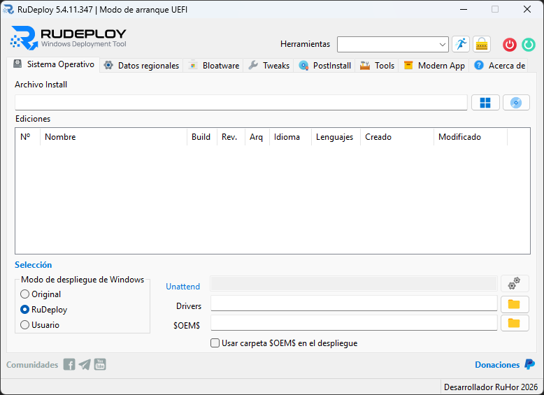
  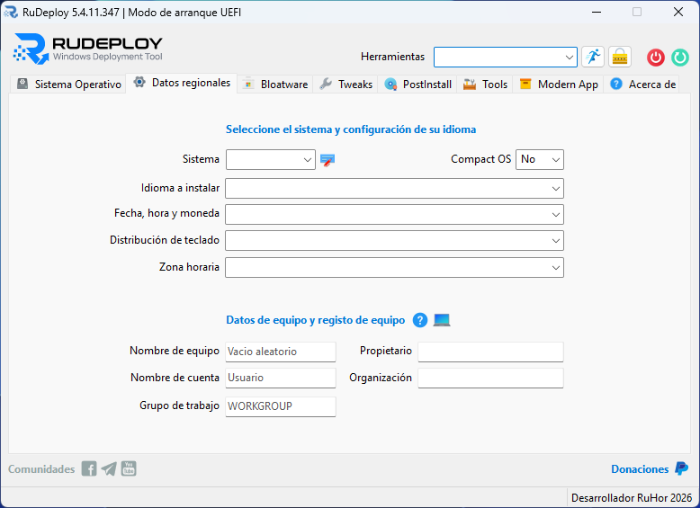
  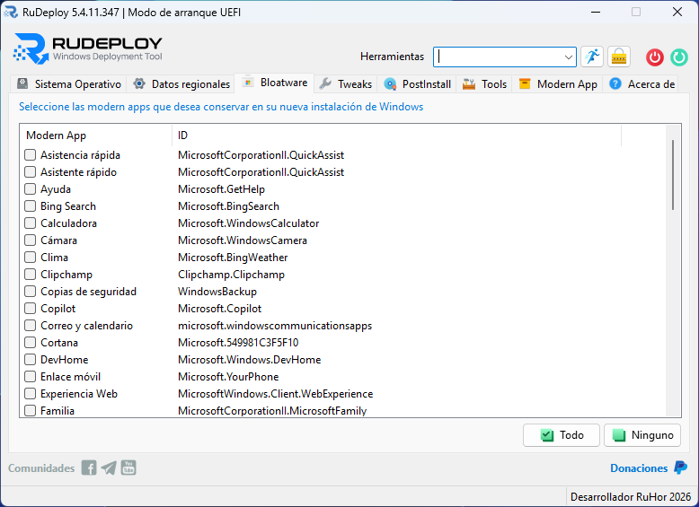

  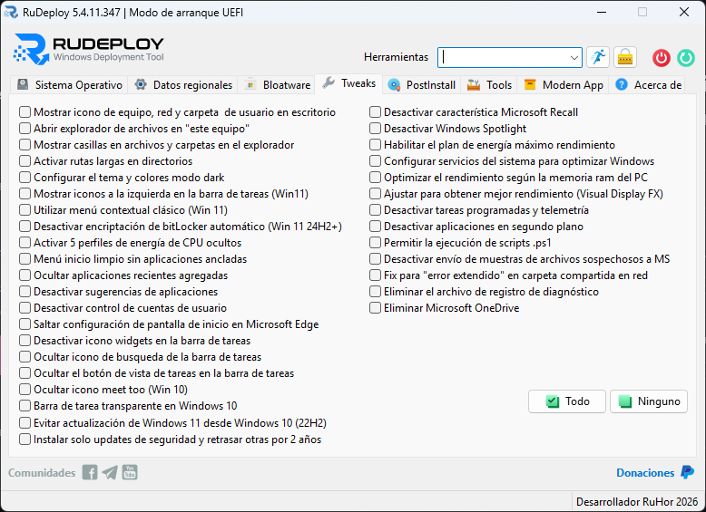
  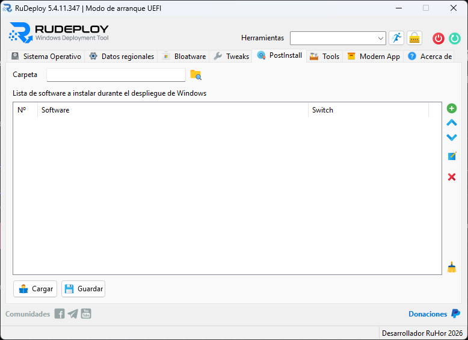
  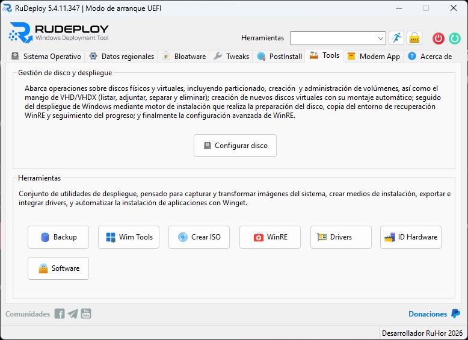

  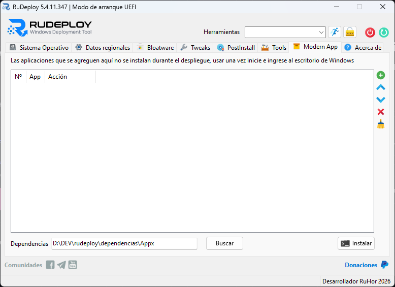
  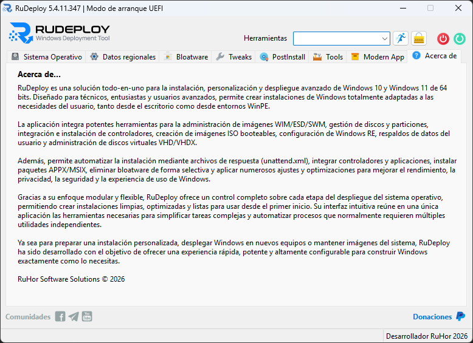
  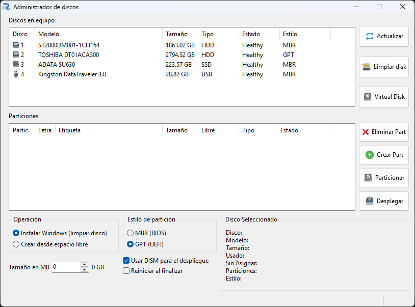

  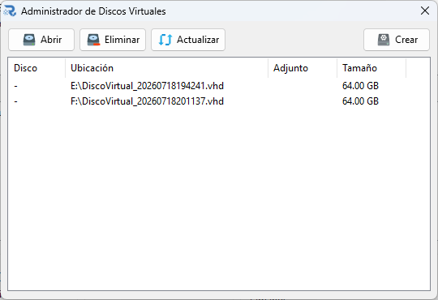
  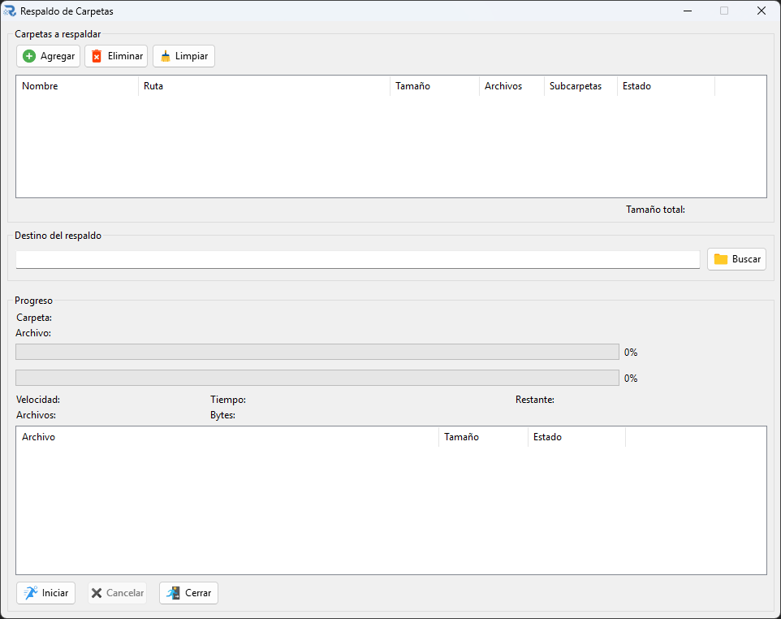
  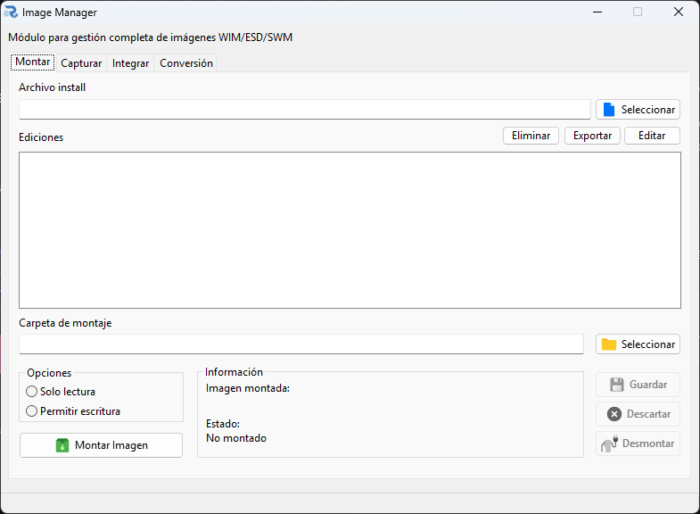

  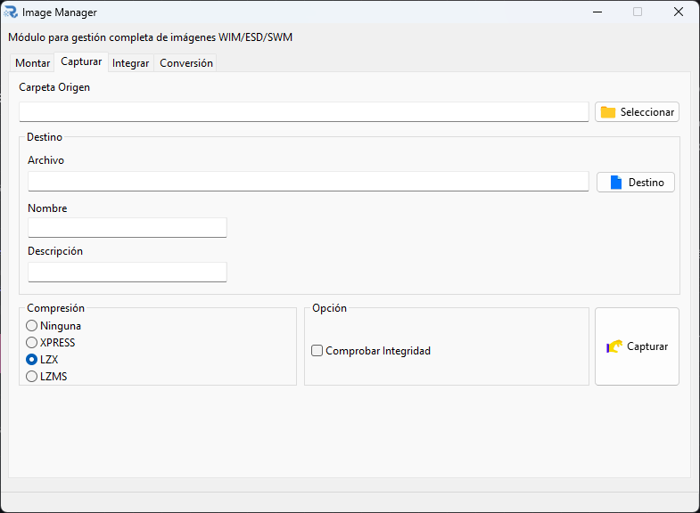
  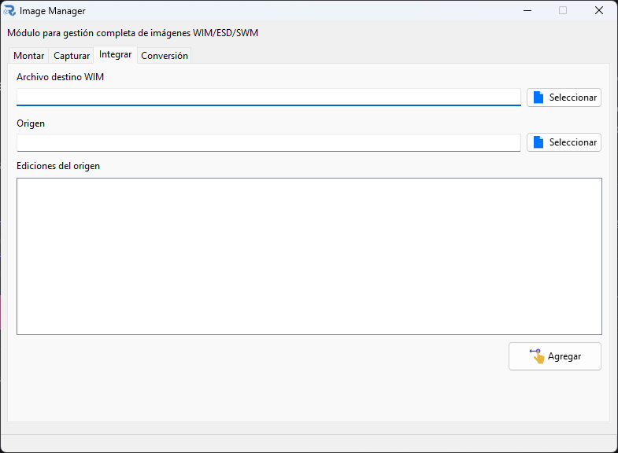
  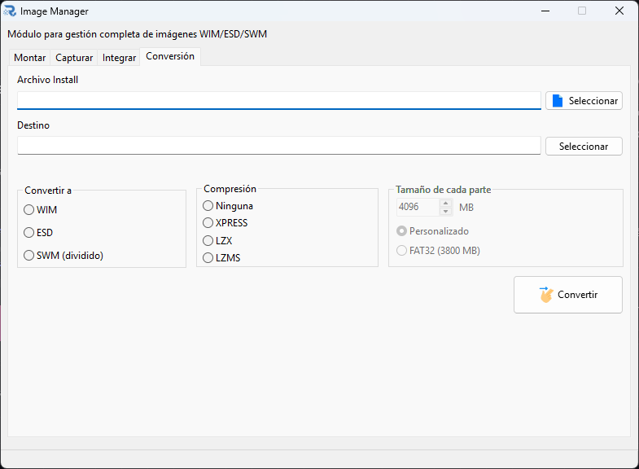  

  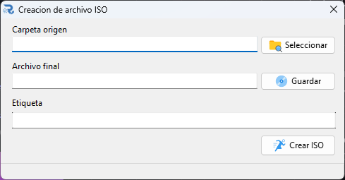
  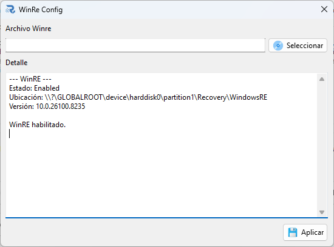
  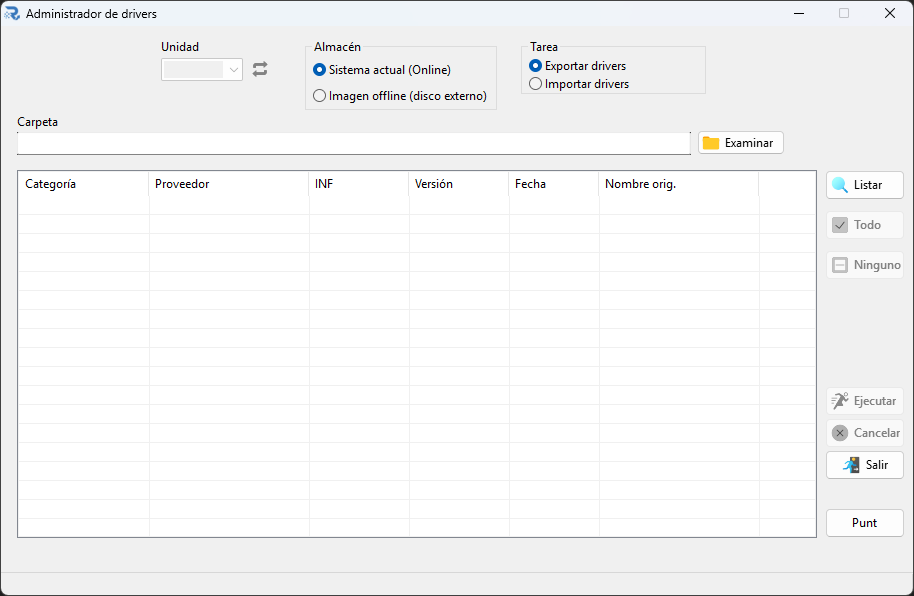

  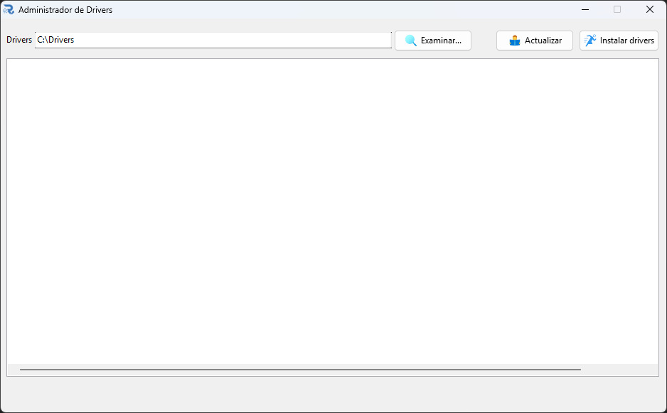
  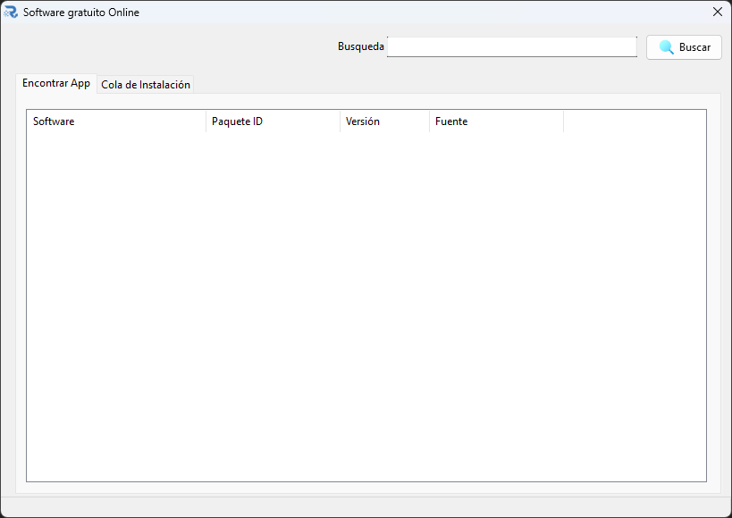
  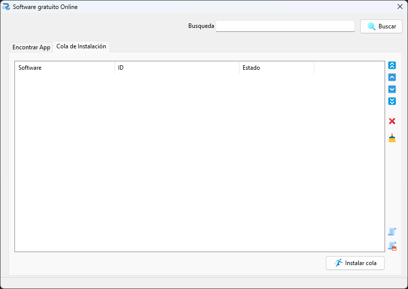  

---

## Archivos de configuración

| Archivo | Propósito |
|---------|-----------|
| `Bloatware.json` | Lista de aplicaciones modernas para la pestaña Bloatware |
| `ToolsRu.json` | Configuración de herramientas externas |
| `oem.ini` | Datos OEM (fabricante, modelo, teléfono, URL) |
| `config.json` | Configuración general de la aplicación |
| `soconf.ini` | Preajustes de configuración regional |

## Dependencias externas

- `libwim-15.dll` — Motor wimlib para operaciones con imágenes WIM/ESD
- `oscdimg.exe` — Creador de imágenes ISO
- `7z.dll` — Extracción de archivos comprimidos

## Requisitos

- Windows 10/11 de 64 bits
- Ejecutar como Administrador para operaciones de disco, drivers y despliegue
- Windows ADK (opcional, para funcionalidad DISM completa)
- .NET Framework 3.5+ (para ciertas operaciones DISM)

---

## Tecnologías utilizadas

RUDeploy ha sido desarrollado utilizando las siguientes tecnologías y herramientas:

- **Free Pascal (FPC)** – Lógica principal de la aplicación.
- **Lazarus IDE** – Desarrollo de la interfaz gráfica.
- **DISM** – Administración y personalización de imágenes de Windows.
- **wimlib** – Captura y despliegue de imágenes WIM.
- **7-Zip** – Compresión y extracción de archivos.
- **PowerShell** – Automatización de tareas de Windows.
- **GitHub** – Distribución de versiones y documentación.

---

## Comunidad y redes sociales

Mantente al día con las novedades de RUDeploy:

---

## Apoya el proyecto

Si RUDeploy te resulta útil y deseas apoyar su desarrollo, puedes hacerlo mediante una donación.

- 💙 PayPal: https://www.paypal.com/paypalme/JorgeTene

Tu apoyo ayuda a seguir mejorando RUDeploy y a mantener el proyecto activo.

---

## ¿Te gusta RUDeploy?

Si el proyecto te ha sido útil, considera dejar una ⭐ en este repositorio de GitHub. Es una excelente forma de apoyar el desarrollo y ayudar a que más personas descubran RUDeploy.

**RuHor Software Solutions (c)  2019 - 2026**

---
## **Nota:** 

> Las capturas de pantalla y la documentación de este README corresponden a la **próxima versión 5.x.x.x** de RUDeploy. Mientras tanto, la versión disponible en **Releases** es la **4.3.21.55**.

